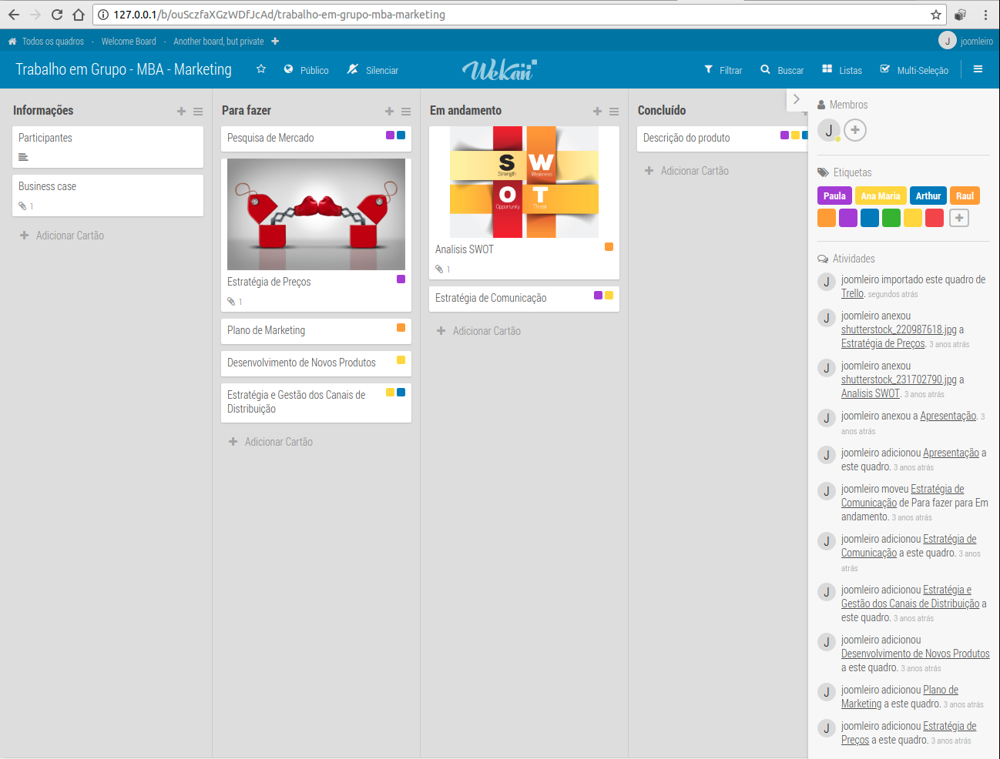
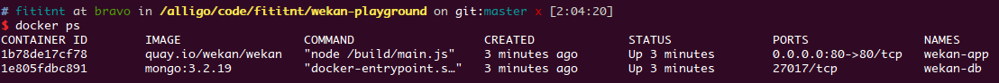
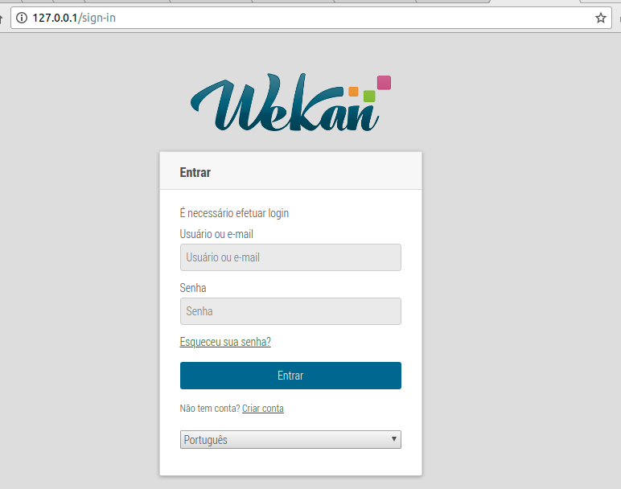
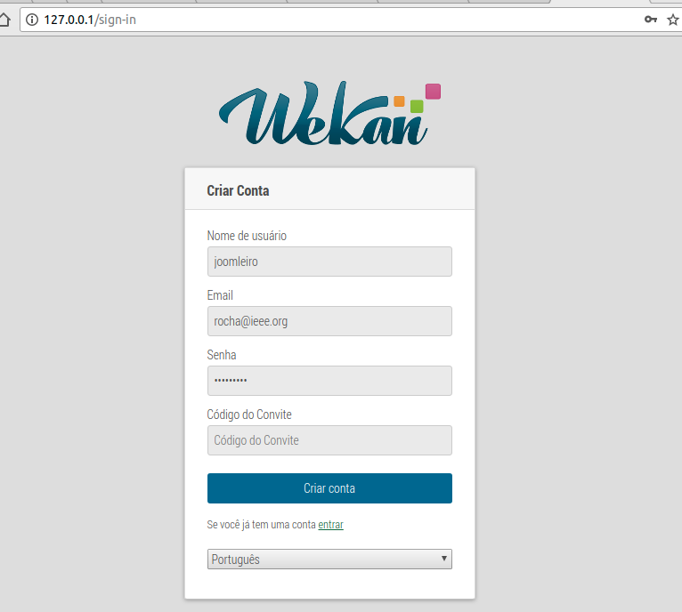
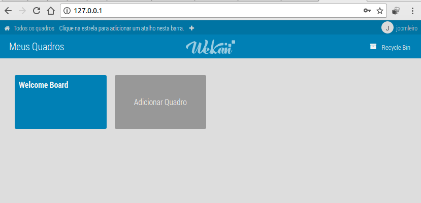
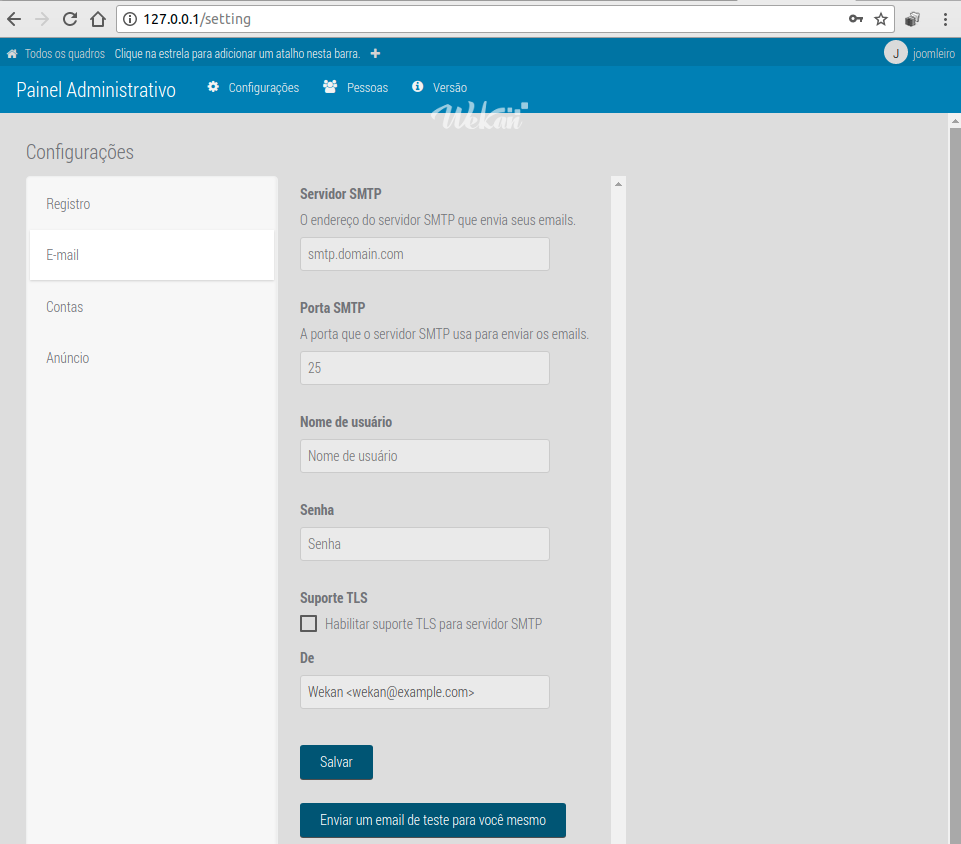
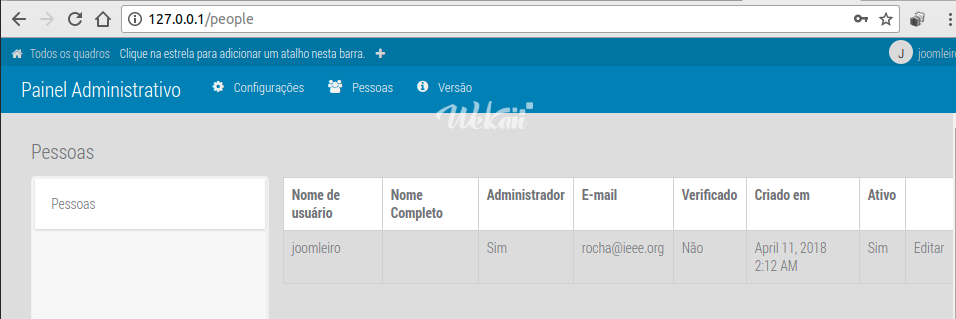
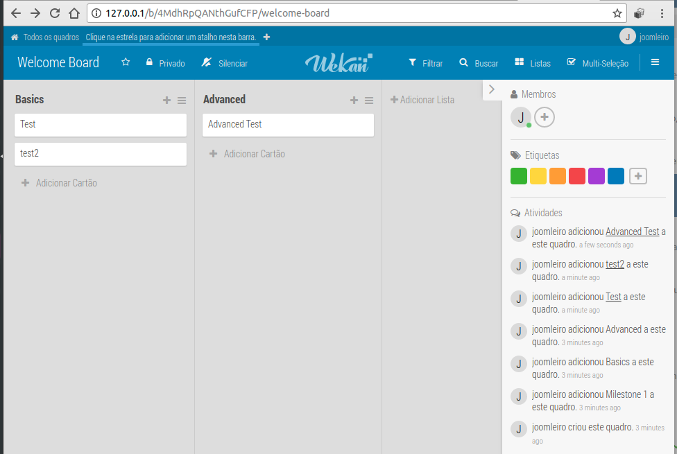
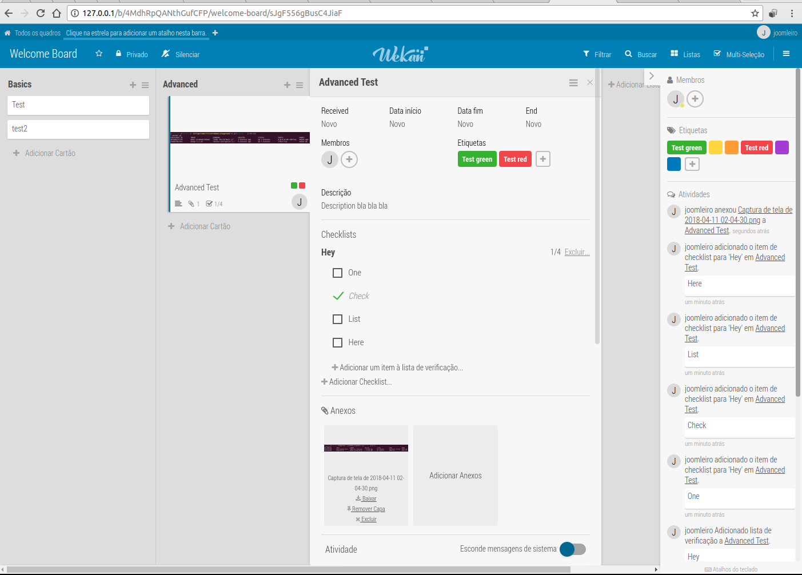
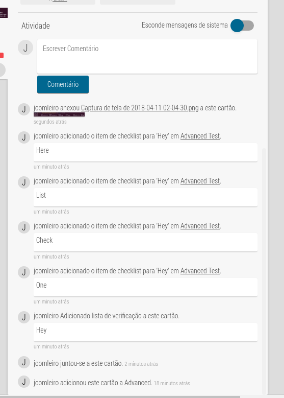

# wekan-playground
Rocha's playgrond for Wekan ("The open-source Trello-like kanban").

In my honest opinion, for who is looking for a open source & self-hosted
Trello-like software, you can use <https://github.com/wekan/wekan-mongodb> as
easy way to test on Docker.

- Website: <https://wekan.github.io/>
- General install instructions with Docker: <https://github.com/wekan/wekan/wiki/Docker>
- Installer with docker-compose: <https://github.com/wekan/wekan-mongodb>

---



## Logbook

```bash

## Download docker-compose.yml file from maitaner at https://github.com/wekan/wekan-mongodb
wget https://raw.githubusercontent.com/wekan/wekan-mongodb/master/docker-compose.yml

docker-compose up

# See fulllogs.sh

## Open your browser at http://127.0.0.1 or http://localhost
xdg-open http://127.0.0.1

## Edit docker-compose services.wekan.environment ROOT_URL to a URL used
## or some URLs will redirect user to http://example.com/...
vim docker-compose.yml

# Stop docker-compose (Ctrl + C on screen running docker-compose up)

# Start again docker-compose
docker-compose up

## Stop and clean all resources (DO NOT RUN `docker-compose down --volumes --rmi all` ON PRODUCTION)
docker-compose down --volumes --rmi all

```

See [fulllogs.sh](fulllogs.sh).

## Screenshots










.png)


## Enviroment

```
## Ubuntu 16.04.4 LTS
# Requires Need docker and docker-compose. Used:

$ docker -v
Docker version 17.12.1-ce, build 7390fc6

$ docker-compose -v
docker-compose version 1.18.0, build 8dd22a9
```
